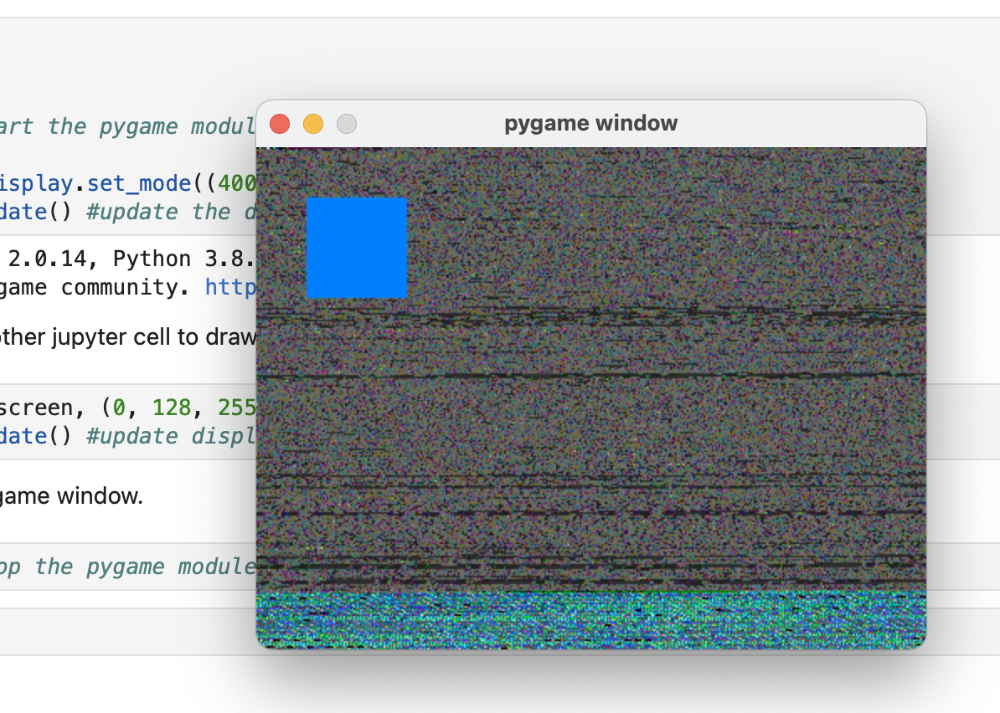
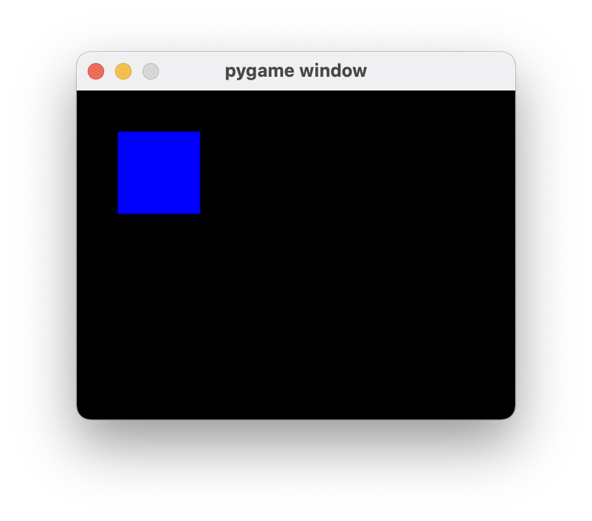
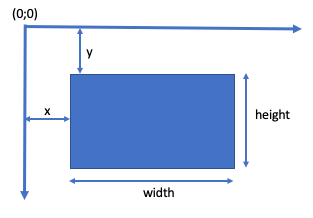
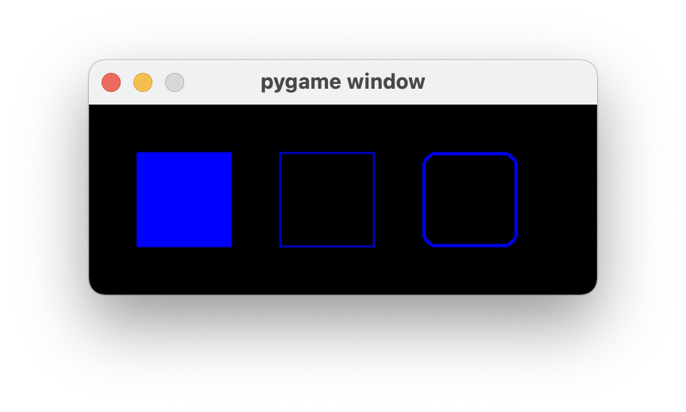
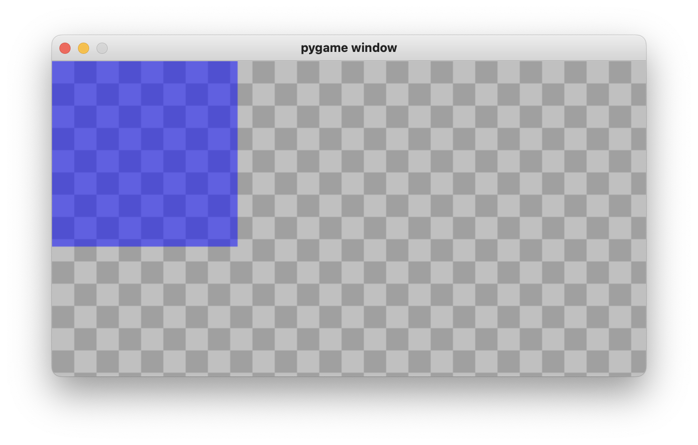
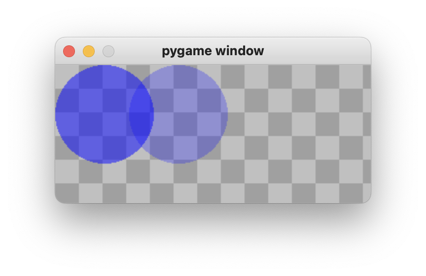

# Pygame Cookbook - Recipes for Mastering Pygame

Hi,

in the last years I used **Python** and the module **Pygame** to create some games. I found many information about **Pygame** on many different places in the web. I would prefer one book where I can look for solutions. So I started to write this `Pygame Cookbook`.  

**Pygame** (https://www.pygame.org) is a create library for making your own games with python. **Pygame** uses the **SDL** library.

This `Pygame Cookbook` tries to explain the building blocks of a game simple and in detail.

The official documentation of **Pygame** is available at https://www.pygame.org/docs/.

If you like `Pygame Cookbook`, use it. If you have some suggestions, tell me (hebi@python-ninja.com).

All game assets that I use in recipes are from https://www.kenney.nl. Thank you.

Have fun.

Hebi, on the way to Python Ninja

`Edition 0.32, July 2023`

## install pygame

Prerequisite for using the `Pygame Cookbook` is that the Python library **Pygame** is installed on your computer.
$ pip install pygame
More about installing pygame https://www.pygame.org/wiki/GettingStarted#Pygame%20Installation

You can use **Pygame** with different programming environments. A very convenient way to try the recipes of this Cookbook is to copy the **Jupyter Notebook** version (file *pygame-cookbook.ipynb*) to your computer and evaluate the cells your interested in.

## pygame and jupyter notebooks

#### Task: Using pygame with Jupyter Notebooks

**Solution:**

Open a window that shows the drawing of pygame.  

You can 


```python
%gui qt
import pygame
 
pygame.init() #start the pygame module

screen = pygame.display.set_mode((400, 300)) #get access to the display

pygame.display.update() #update the display
```

    pygame 2.0.1 (SDL 2.0.14, Python 3.8.8)
    Hello from the pygame community. https://www.pygame.org/contribute.html


Now you can use another jupyter cell to draw a rectangle.


```python
pygame.draw.rect(screen, (0, 128, 255), pygame.Rect(30, 30, 60, 60)) #draw a rectangle

pygame.display.update() #update display
```

At least close the pygame window.


```python
pygame.quit() #stop the pygame module
```

<br><br><br><br><br><br><br><br><br><br><br>

**Explanation:**

With the magic command`%gui qt` **Jupyter** can work together with **Pygame**. This enables the use of the Jupyter GUI and the entries in the Pygame window at the same time. Therefore every recipe in this `Pygame Cookbook` has the magic command`%gui qt` in the first line.

You don't need that, if you want to try a recipe in a different Python environment.

**More:**

https://ipython.readthedocs.io/en/stable/config/eventloops.html

## simple gameloop

#### Task: simple program structure that works with every game

**Solution:**

Opens a window that shows the drawing of pygame.


```python
%gui qt
import pygame

# ---- Initialize ----

pygame.init()

SIZE = WIDTH, HEIGHT = 320, 240
BLACK = 0, 0, 0
BLUE = 0, 0, 255

running = True
screen = pygame.display.set_mode(SIZE)

# ---- Game loop ----

while running:
    
    # ---- input ----
    for event in pygame.event.get():
        if event.type == pygame.QUIT: 
            running = False
    
    # ---- update ---- 
    
    # ---- draw ----
    screen.fill(BLACK)
    pygame.draw.rect(screen, BLUE, pygame.Rect(30, 30, 60, 60)) #draw a rectangle
    pygame.display.flip()

# ---- Quit ----

pygame.quit()
```

<br><br><br><br><br><br><br><br><br><br>

**Explanation:**

Every game consists of the same building blocks:
    
* **Input**: Read input from player. Which keys are pressed? Did the  mouse move? Any other input device lika a joystick?
* **Update**: Do the changes in the game world
* **Draw**: Show the changes on the screen  
    
* and start all over again

This is called **game loop** or **event loop**.

`import pygame` .. import the Pygame module  
`init() -> (numpass, numfail)` .. initialize all imported Pygame modules. Some Pygame modules needs to be initialized. Return value *numfail* shows how many modules could not be initialized by Pygame.

`pygame.display.set_mode()` .. return a *Surface* object on which python can draw. The first parameters define the size. The created display will be the best supported by the system. 

There are many additional flags:

`pygame.FULLSCREEN` .. fullscreen no window  
`pygame.HWSURFACE` .. hardware accelerated (only fullscreen). 
`pygame.OPENGL` .. create an OpenGL-renderable display  
`pygame.RESIZABLE` .. resizable window  
`pygame.NOFRAME` .. window without border or controls  

`pygame.event.get(eventtype=None) -> Eventlist` .. get next event from Pygame.   
`if event.type == pygame.QUIT: ` .. user clicked on the close control of the window.

`screen.fill(BLACK)` .. fill the complete display with color   
`pygame.draw.rect` .. draw a rectangle on the display

`pygame.display.flip()` .. show changed display on the screen

`pygame.quit() -> None` .. uninitialize all imported Pygame modules

This **loop** will be used in the most recipes.

**more**  
* Pygame documentaion https://www.pygame.org/docs/

## gameloop with timing

#### Task: integrating time into the game loop

**Solution:**

using class **pygame.time.clock** to get a good timing


```python
%gui qt
import pygame

# ---- Initialize ----

pygame.init()

SIZE = WIDTH, HEIGHT = 320, 240
BLACK = 0, 0, 0
BLUE = 0, 0, 255

running = True
screen = pygame.display.set_mode(SIZE)

clock = pygame.time.Clock() #create clock object

FRAMES_PER_SECOND = 30      #who many pictures per second should pygame generate?

x_position = 60             #position of the blue rectangel
PIXELS_PER_SECOND = 40      #how many pixels per second should the rectangele be moved?

# ---- Game loop ----

while running:
    
    # ---- input ----
    for event in pygame.event.get():
        if event.type == pygame.QUIT: 
            running = False
    
    # ---- update ---- 
    delta_time = clock.tick(FRAMES_PER_SECOND)     # time since last frame
    
    x_position = x_position + delta_time/1000 * PIXELS_PER_SECOND #next position of the rectanel
 
    if x_position > WIDTH: #rectangele vanishes right start from left again
        x_position = 0
    
    # ---- draw ----
    screen.fill(BLACK)
    pygame.draw.rect(screen, BLUE, pygame.Rect(int(x_position), 30, 60, 60)) #draw a rectangle
    pygame.display.flip()

# ---- Quit ----

pygame.quit()
```

**Explanation:**

**Pygame** comes with an integrated class for timing: **pygame.time.Clock**

**-Initialize-**

First you have to create your own **clock** object.  

`clock = pygame.time.Clock()`

`FRAMES_PER_SECOND = 30` .. you have to define how many frames (pictures) should be maximal drawn by **Pygame** in a second

`x_position = 60` .. the blue rectangle will move from left to right. In every frame the script will use the time since the last frame to calculate the new position.  

`PIXELS_PER_SECOND = 40` .. the speed (velocity) of the rectangle will be 40 pixels in one second.

**-Game loop update()-**

`delta_time = clock.tick(FRAMES_PER_SECOND)` .. returns the milliseconds since the last frame.   
The parameter *FRAMES_PER_SECOND* defines the maximal number of frames per second. It limits the runtime. **Pygame** will not draw more frames per second.

`x_position = x_position + delta_time/1000 * PIXELS_PER_SECOND` .. to get the distance covered since the last frame you have to multiply the elapsed time by the velocity. *delta_time* is in milliseconds but you need the time in seconds. So you have to divide with thousand.
 
`if x_position > WIDTH: x_position = 0`.. before the rectangel is vanishing from the screen you have to start from the left side again

## basics

#### coordinates


```python

```

#### colors <a id='colors'></a>


```python

```

#### Rect <a id='Rect'></a>


```python

```

<br><br><br><br><br><br><br><br><br><br>

## draw

### rectangle

#### Task: drawing a rectangle

**Solution:**


```python
%gui qt
import pygame

pygame.init()

SIZE = WIDTH, HEIGHT = 320, 240
running = True
screen = pygame.display.set_mode(SIZE)

while running:
    
    for event in pygame.event.get():
        if event.type == pygame.QUIT: 
            running = False
            
    screen.fill(pygame.Color('black'))
    pygame.draw.rect(screen, pygame.Color('blue'), pygame.Rect(30, 30, 60, 60))
    pygame.display.flip()

pygame.quit()
```


```python
%gui qt
import pygame

# ---- Initialize ----

pygame.init()

SIZE = WIDTH, HEIGHT = 320, 120

running = True
screen = pygame.display.set_mode(SIZE)

# ---- Game loop ----

while running:
    
    # ---- input ----
    for event in pygame.event.get():
        if event.type == pygame.QUIT: 
            running = False
    
    # ---- update ---- 
    
    # ---- draw ----
    screen.fill(BLACK)
    
    pygame.draw.rect(screen, pygame.Color('blue'), pygame.Rect(30, 30, 60, 60)) #fill area
    
    pygame.draw.rect(screen, pygame.Color('blue'), pygame.Rect(120, 30, 60, 60), width=1) #border
    
    pygame.draw.rect(screen, pygame.Color('blue'), pygame.Rect(210, 30, 60, 60), width=2, border_radius=8) #rounded border
    
    pygame.display.flip()

# ---- Quit ----

pygame.quit()
```

<br><br><br><br><br><br><br><br><br><br>

**Explanation:**

A rectangle can consist of a fill area and a border.

**Drawing the fill area with function rect**

`rect(surface, color, rect) -> Rec` .. draws a rectangle to the output surface and returns an object of the class **Rect**  

`surface`.. Surface to draw on

`color` .. different ways to describe a [color](#colors) in **Pygame**

`rec` .. rectangle that describes position, width and height

With

`Rect(left, top, width, height) -> Rect` .. you can create a new [Rect](#Rect) from position (left, top) and dimension (width, height)

**Drawing the border with function rect**

`rect(surface, color, rect, width=0, border_radius=0) -> Rect` .. draws the border of a rectangle to the output surface and returns an object of the class **Rect**

`width`.. thickness of the border in Pixel. (if is 0, **Pygame** draws a filled rectangle)

`border_radius`.. draws border with rounded corners (if is 0, no rounded corners)


**more**  
* Pygame documentation http://www.pygame.org/docs/ref/draw.html

### polygon, circle, ellipse, arc 


```python

```

### line


```python

```


```python

```


```python

```


```python

```

## image

## text

#### Task: draw text

**Solution:**


```python
%gui qt
import pygame

running = True

WHITE = (255,255,255)
BLUE = (0,0,255)

pygame.init()
screen = pygame.display.set_mode((640, 340))

sysfont = pygame.font.get_default_font()
print(sysfont)

font = pygame.font.SysFont(None, 24)

pygame.display.flip()

while running:
    for event in pygame.event.get():
        if event.type == pygame.QUIT: 
            running = False
    
    screen.fill(WHITE)
    
    img = font.render("text", True, BLUE)
    rect = img.get_rect()
    rect.midtop = (40,40)
    screen.blit(img, rect)
    
    pygame.display.flip()
            
pygame.quit()
```

    pygame 2.1.2 (SDL 2.0.18, Python 3.9.16)
    Hello from the pygame community. https://www.pygame.org/contribute.html
    freesansbold.ttf


**Explanation:**

`get_default_font() -> str` .. returns the name of the default font


`SysFont(name, size) -> Font` .. create a Font object from the system fonts

`name`.. name of the font, can be None

`size`.. font size


`Font(filename, size) -> Font`.. create Font from file

`filename`.. file name of the font

`size`.. font size


`render(text, antialias, color, background=None) -> Surface` .. creates a new surface with text

`text`.. as string  
`antialias`.. if True than with antialias


The text can only be a single line. The Surface will be of the dimensions required to hold the text.


```python

```

## transparent

#### Task: draw a transparent surface

**Solution:**


```python
%gui qt
import pygame

# ---- Initialize ----

pygame.init()

SIZE = WIDTH, HEIGHT = 640, 340

running = True
screen = pygame.display.set_mode(SIZE)

WHITE = (255,255,255)
BLUE = (0,0,255)
GREY_1 = (160, 160, 160)
GREY_2 = (192, 192, 192)

TILE_SIZE = 24
background = pygame.Surface(SIZE) # background image

for x in range(0,WIDTH//TILE_SIZE+1):
    for y in range(0,HEIGHT//TILE_SIZE+1):
        color = GREY_1
        if (x+y) % 2 == 0:
            color = GREY_2
        pygame.draw.rect(background, color, (x*TILE_SIZE, y*TILE_SIZE, TILE_SIZE, TILE_SIZE))

# ---- Game loop ----

while running:
    
    # ---- input ----
    for event in pygame.event.get():
        if event.type == pygame.QUIT: 
            running = False
    
    # ---- update ---- 
    
    # ---- draw ----
    screen.blit(background, (0, 0))
    
    surface = pygame.Surface((200,200))  # new surface
    surface.set_alpha(128)               # set alpha
    surface.fill(BLUE)             
    
    screen.blit(surface, (0,0))
    
    pygame.display.flip()

# ---- Quit ----

pygame.quit()
```


    ---------------------------------------------------------------------------

    KeyboardInterrupt                         Traceback (most recent call last)

    Cell In[5], line 48
         44     surface.fill(BLUE)             
         46     screen.blit(surface, (0,0))
    ---> 48     pygame.display.flip()
         50 # ---- Quit ----
         52 pygame.quit()


    KeyboardInterrupt: 


If you want a **transparent** image (surface) you have to that the so called **alpha value** of the
surface. Use the set_alpha method for this.  

If the alpha value is 0 it's totaly transparent. You see nothing.
If the value is 255 it's not transpartent.

`set_alpha(value) -> None` .. set alpha value of surface

<br><br><br><br><br><br><br><br><br><br>

#### Task: make every pixel of an image transparent

**Solution:**


```python
%gui qt
import pygame

# ---- Initialize ----

pygame.init()

SIZE = WIDTH, HEIGHT = 320, 140

running = True
screen = pygame.display.set_mode(SIZE)

WHITE = (255,255,255)
BLUE = (0,0,255)
GREY_1 = (160, 160, 160)
GREY_2 = (192, 192, 192)

TILE_SIZE = 24
background = pygame.Surface(SIZE) # background image

for x in range(0,WIDTH//TILE_SIZE+1):
    for y in range(0,HEIGHT//TILE_SIZE+1):
        color = GREY_1
        if (x+y) % 2 == 0:
            color = GREY_2
        pygame.draw.rect(background, color, (x*TILE_SIZE, y*TILE_SIZE, TILE_SIZE, TILE_SIZE))

# ---- Game loop ----

while running:
    
    # ---- input ----
    for event in pygame.event.get():
        if event.type == pygame.QUIT: 
            running = False
    
    # ---- update ---- 
    
    # ---- draw ----
    screen.blit(background, (0, 0))
    
    RADIUS = 50
    
    surface = pygame.Surface((100,100),pygame.SRCALPHA)  # new surface per pixel alpha
    pygame.draw.circle(surface, (0,0,255,128), (RADIUS, RADIUS), RADIUS) # with alpha
    screen.blit(surface,(0,0))
    
    surface = pygame.Surface((100,100),pygame.SRCALPHA)  # new surface per pixel alpha
    pygame.draw.circle(surface, (0,0,255,64), (RADIUS, RADIUS), RADIUS) # with alpha
    screen.blit(surface,(75,0))
    
    pygame.display.flip()

# ---- Quit ----

pygame.quit()
```

`surface = pygame.Surface((100,100),pygame.SRCALPHA)`

If you want to set an alpha value (transparence) separatly for every pixel to have
to use **pygame.SRCALPHA** when creating a surface. Now pygame knows that you wants
to use alpha values.

`pygame.draw.circle(surface, (0,0,255,128), (RADIUS, RADIUS), RADIUS)`

In the color value you can now add the alpha value (128), too.

<br><br><br><br><br><br><br><br><br><br>

**more** 
* Draw a transparent rectangle in pygame https://stackoverflow.com/questions/6339057/draw-a-transparent-rectangle-in-pygame

## mouse

#### Task: drag with the mouse

**Solution:**


```python
%gui qt
import pygame

# ---- Initialize ----

pygame.init()

SIZE = WIDTH, HEIGHT = 320, 240
BLACK = 0, 0, 0
BLUE = 0, 0, 255

running = True
screen = pygame.display.set_mode(SIZE)

rectangle = pygame.rect.Rect(176, 134, 80, 80)
draging = False

pygame.mouse.set_visible(True)

# ---- Game loop ----

while running:
    
    # ---- input ----
    for event in pygame.event.get():
        if event.type == pygame.QUIT: 
            running = False
            
        elif event.type == pygame.MOUSEBUTTONDOWN:           
            if rectangle.collidepoint(event.pos):
                draging = True
                mouse_x, mouse_y = event.pos
                offset_x = rectangle.x - mouse_x
                offset_y = rectangle.y - mouse_y

        elif event.type == pygame.MOUSEBUTTONUP:          
            draging = False

        elif event.type == pygame.MOUSEMOTION:
            if draging:
                mouse_x, mouse_y = event.pos
                rectangle.x = mouse_x + offset_x
                rectangle.y = mouse_y + offset_y
    
    # ---- update ---- 
    
    # ---- draw ----
    screen.fill(BLACK)
    pygame.draw.rect(screen, BLUE, rectangle) #draw a rectangle
    pygame.display.flip()

# ---- Quit ----

pygame.quit()
```


```python

```


```python

```

## keyboard

#### Task: get every pressed key

**Solution:**


```python
%gui qt
import pygame

running = True

WHITE = (255,255,255)
BLUE = (0,0,255)
GREEN = (0,255,0)

screen = pygame.display.set_mode((640, 340))

rectangle = pygame.rect.Rect(200, 150, 40, 40)
rect_color = BLUE

while running:

    right_color = GREEN
    left_color = GREEN
    up_color = GREEN
    down_color = GREEN
    
    for event in pygame.event.get():
        if event.type == pygame.QUIT: 
            running = False
            
    keys=pygame.key.get_pressed()
    
    if keys[pygame.K_RIGHT]:
        right_color = BLUE
        
    if keys[pygame.K_LEFT]:
        left_color = BLUE
        
    if keys[pygame.K_UP]:
        up_color = BLUE
        
    if keys[pygame.K_DOWN]:
        down_color = BLUE
    
    screen.fill(WHITE)
    
    pygame.draw.rect(screen, right_color, (200, 100, 100, 100))
    pygame.draw.rect(screen, left_color, (0, 100, 100, 100))
    pygame.draw.rect(screen, up_color, (100, 0, 100, 100))
    pygame.draw.rect(screen, down_color, (100, 200, 100, 100))
    
    pygame.display.flip()

pygame.quit()
```

    pygame 2.1.2 (SDL 2.0.18, Python 3.9.16)
    Hello from the pygame community. https://www.pygame.org/contribute.html


`get_pressed() -> bools` .. get a boolean value for every key on the keybaord. Is *True* if key is pressed.

## events

## collision

### point - rectangle

#### Task: detecting a point in a rectangle

**Solution:**


```python
%gui qt
import pygame

# ---- Initialize ----

pygame.init()

SIZE = WIDTH, HEIGHT = 320, 240
WHITE =  255, 255 ,255
BLUE = 0, 0, 255
GREEN = 0, 255, 0

running = True
screen = pygame.display.set_mode(SIZE)

rectangle = pygame.rect.Rect(50, 50, 100, 100)
rect_color = BLUE

# ---- Game loop ----

while running:
    
    # ---- input ----
    for event in pygame.event.get():
        if event.type == pygame.QUIT: 
            running = False
        elif event.type == pygame.MOUSEMOTION:           
            if rectangle.collidepoint(event.pos):
                rect_color = GREEN
            else:         
                rect_color = BLUE
    
    # ---- update ---- 

    # ---- draw ----
    screen.fill(WHITE)
    pygame.draw.rect(screen, rect_color, rectangle)
    pygame.display.flip()

# ---- Quit ----

pygame.quit()

```

**Explanation:**

`rect.collidepoint((x,y)) -> bool` returns True if point is within rect  

**more**  
* pygame documentation rect https://www.pygame.org/docs/ref/rect.html

### rectangle - rectangle


```python

```

`rect.colliderect(Rect) -> bool` returns True if rectangles overlap  
`rect.collidelist(list) -> index` returns index of the *first* rectangle that overlaps; -1 if nothing is found
`rect.collidelistall(list) -> indices` returns indexes of all rectangles that overlap


### rectangle - line

#### Task: detecting a line in a rectangle


```python
%gui qt
import pygame

# ---- Initialize ----

pygame.init()

SIZE = WIDTH, HEIGHT = 320, 240
WHITE = 255, 255, 255
BLACK = 0, 0, 0
BLUE = 0, 0, 255
GRAY = 127, 127, 127
GREEN = 0, 255, 0

running = True
screen = pygame.display.set_mode(SIZE)

clock = pygame.time.Clock() #create clock object

FRAMES_PER_SECOND = 30      #who many pictures per second should pygame generate?

x_position = 60             #position of the blue rectangel
PIXELS_PER_SECOND = 40      #how many pixels per second should the rectangele be moved?

start_pos = (120,0)
end_pos = (120,200)

# ---- Game loop ----

while running:
    
    # ---- input ----
    for event in pygame.event.get():
        if event.type == pygame.QUIT: 
            running = False
    
    # ---- update ---- 
    delta_time = clock.tick(FRAMES_PER_SECOND)     # time since last frame
    
    x_position = x_position + delta_time/1000 * PIXELS_PER_SECOND #next position of the rectanel
 
    if x_position > WIDTH: #rectangele vanishes right start from left again
        x_position = 0
    
    # ---- draw ----
    screen.fill(BLACK)
    rect = pygame.Rect(int(x_position), 30, 60, 60)
    
    clip = rect.clipline(start_pos,end_pos)
    
    if len(clip) > 0:
        pygame.draw.rect(screen, GRAY, rect)
        pygame.draw.line(screen, WHITE, start_pos, end_pos, width=1)
        pygame.draw.line(screen, GREEN, clip[0], clip[1])
    else:
        pygame.draw.rect(screen, BLUE, rect)
        pygame.draw.line(screen, WHITE, start_pos, end_pos, width=1)
    
    
    pygame.display.flip()

# ---- Quit ----

pygame.quit()
```

    pygame 2.1.1 (SDL 2.0.18, Python 3.9.7)
    Hello from the pygame community. https://www.pygame.org/contribute.html


`clipline(x1, y1, x2, y2) -> ((cx1, cy1), (cx2, cy2))` ..
returns the coordinates of a line that in rectangle; an empty tuble when line complete out rectangle

### pixel - pixel


```python
%gui qt
import pygame
pygame.init()

SIZE = WIDTH, HEIGHT = 320, 240
BLACK = 0, 0, 0

running = True
clock = pygame.time.Clock()
fps = 30
screen = pygame.display.set_mode(SIZE)

ball = pygame.image.load("Freddy.png")
ballrect = ball.get_rect()
ballrect.center = (200,100)
ballmask = pygame.mask.from_surface(ball)


ball2 = pygame.image.load("Freddy.png")
ballrect2 = ball2.get_rect()
ballmask2 = pygame.mask.from_surface(ball2)

position = pygame.Vector2(100, 100)
velocity = pygame.Vector2(10,0)

while running:
    for event in pygame.event.get():
        if event.type == pygame.QUIT: 
            running = False

    delta_time = clock.tick(fps) / 1000.0
    position = position + velocity * delta_time
    ballrect2.center = position
    
    offset_x = ballrect2.left - ballrect.left
    offset_y = ballrect2.top - ballrect.top
    
    if ballmask.overlap(ballmask2, (offset_x, offset_y)) != None:
        print('collision')
        
    screen.fill(BLACK)
    screen.blit(ball, ballrect)
    screen.blit(ball2, ballrect2)
    pygame.display.flip()

pygame.quit()
```


```python
pygame.quit()
```

`from_surface(Surface) -> Mask`.. Creates a *Mask* object from the *Surface* by setting all the opaque pixels and not setting the transparent pixels  
`overlap(othermask, offset) -> (x, y)`.. Returns the first point of intersection encountered between this mask and *othermask*. *None* if there is no overlaping. *offset* is the distance between the two masks.

### sprite - sprite


```python

```

**more**  
* Collision Detection in PyGame LMU 2017 https://www.medien.ifi.lmu.de/lehre/ss17/mmp/uebung/uebung7/mmp_uebung_7_ss17.pdf
* pygame documentation rect https://www.pygame.org/docs/ref/rect.html
* pygame documentation sprite https://www.pygame.org/docs/ref/sprite.html
* pygame documentation mask https://www.pygame.org/docs/ref/mask.html


```python

```

## opengl

### start

#### Task: using OpenGl with pygame

**Solution:**

install Python packages **numpy**,**PyOpenGL** and **PyOpenGL_accelerate**

`
pip install numpy PyOpenGL PyOpenGL_accelerate
`


```python
%gui qt
import pygame

from OpenGL.GL import *
from OpenGL.GLU import *

verticies = ((1, -1, -1),(1, 1, -1),(-1, 1, -1),(-1, -1, -1),
             (1, -1, 1),(1, 1, 1),(-1, -1, 1),(-1, 1, 1))

edges = ((0,1),(0,3),(0,4),(2,1),
         (2,3),(2,7),(6,3),(6,4),
         (6,7),(5,1),(5,4),(5,7))

# ---- Initialize ----

pygame.init()

SIZE = WIDTH, HEIGHT = 640, 480
BLACK = 0, 0, 0
BLUE = 0, 0, 255

#pygame.display.gl_set_attribute(pygame.GL_MULTISAMPLEBUFFERS,1) #antialiasing
#pygame.display.gl_set_attribute(pygame.GL_MULTISAMPLESAMPLES,4)

#pygame.display.gl_set_attribute(pygame.GL_CONTEXT_PROFILE_MASK, #compatibility
#                                pygame.GL_CONTEXT_PROFILE_CORE)

running = True
screen = pygame.display.set_mode(SIZE,pygame.DOUBLEBUF | pygame.OPENGL)

gluPerspective(45, (WIDTH/HEIGHT), 0.1, 50)
glTranslatef(0.0,0.0,-5)

# ---- Game loop ----

while running:
    
    # ---- input ----
    for event in pygame.event.get():
        if event.type == pygame.QUIT: 
            running = False
    
    # ---- update ---- 
    
    # ---- draw ----
    glRotatef(1, 3, 1, 1)
    glClear(GL_COLOR_BUFFER_BIT|GL_DEPTH_BUFFER_BIT)
    
    glBegin(GL_LINES)
    for edge in edges:
        for vertex in edge:
            glVertex3fv(verticies[vertex])
    glEnd()
    
    pygame.display.flip()
    pygame.time.wait(10)

# ---- Quit ----

pygame.quit()
```


```python

```
